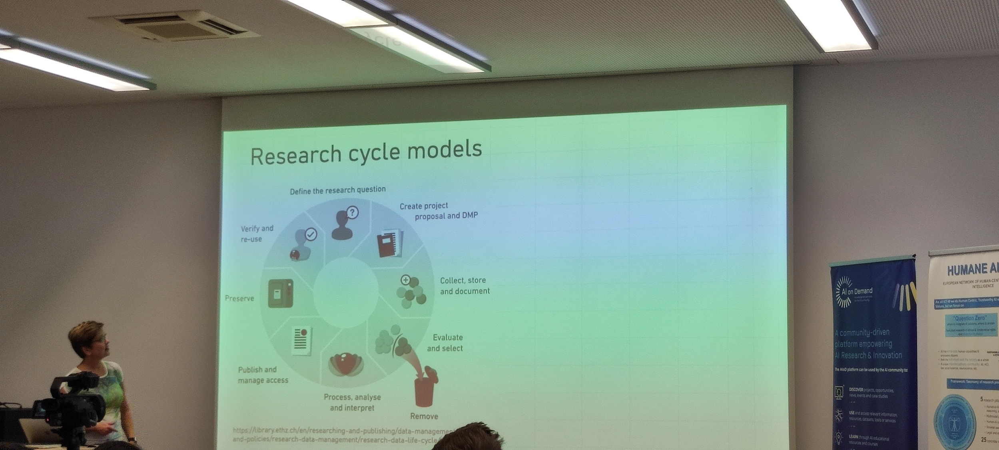
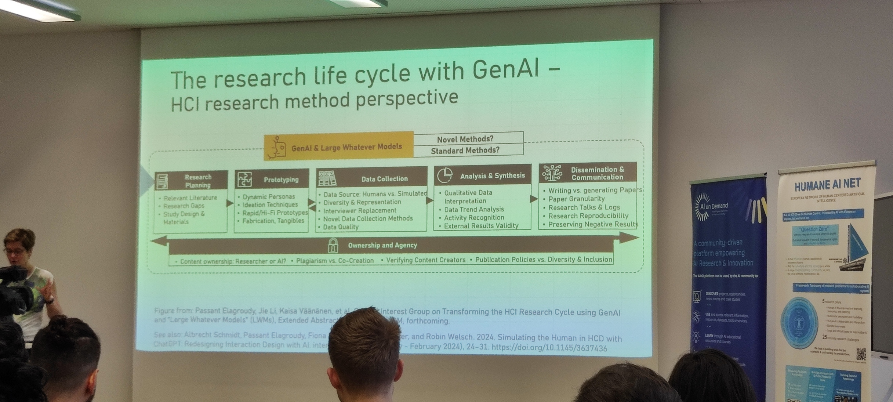
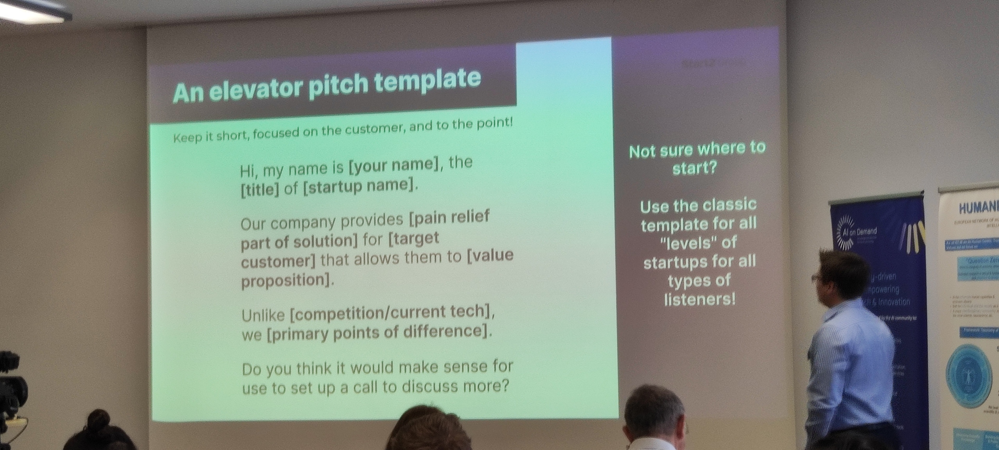

# Introduction

output : title and abstract, target topic, documentation in jupiter colab

@humaneainet. 

# The research cycle and LLMs

### Different types of approach
experimental, contrsuctive, desgin science, case study, action ...

### Models

### Perspective of the industry on AI (Jie Lin)

##### What is synthetic user research ?
use ai to creat virtual participants for the purpose of gathering user feedback and testing products/ideas.

> you type what type of audience you are targeting, and in antoher field, you can input a problem you want to face or want to solve not sure 

genAI contributes to research with :
- aggregate info from various sources
- perform translatation
- recognize actions

possible uses : 
- provide templates (interview guides observation instructions...)

### How to pitch (Corey Wright)

how you create value to the people youre speaking to

user : the one using the product (ex : phd student)
customer : the one buying the product (ex : professor in a research department)

##### Don't

- don't make the story about you
- don't focus on the product
- don't use technical jargon or talk too much about the technology (especially in front of a mixed audience)
- don't try to pitch every little consideration and detail
- don't put people to sleep or make them bored
- don't forget to take a breath
- don't be afraid to pitch a big vision

##### Do's

- show passion and "why" you care about this
- focus on the problem (that you are solving)
- explain why your technology solves the problem
- show you are smart and pay attention to details
- stand out from the crow, be memorable
- smile and be friendly
- give the audience a real CTA (call to action)
- make the listener hungry for more

(tip : practice the presentation 20 times in front of a mirror)

### Beyond prompt engineering (Albrecht Schmidt)

saves time when you know what you're doing
get an understanding on how LLMs work

##### Prompting -Zero,onenfew shot prompting
**zero shot :** task description, prompt
**one shot :** task description, example of what you want and then the prompt
**few shot :** task description, examples then the prompt (the examples can tackle a different subject than what your prompt is targeting)

##### Prompting instruction cheat sheet
- define the task chatgpt has to do, who he should act as, give it a personality (more than one sentence)
- explain him how he should explain things (explain to a 12 year old, a phd student etc)
- dont use *"answer the question"*, *"give me"* but use *"summarize"*, *"list"*, *"ask"*, *"classify"* etc..
- define the output format of the output (ex a list of steps, a formalula, a json etc) 
- define the lenght and the level of detail you expect
- define the style, the way the model should convey the message (be more specific than *"friendly"* , *"neutral"* and use *"emphatic"* etc) 

##### Self refine 

try to aim the discussion where you want to go before making your prompt
divide and conquer, divide your prompt in multiple cprompts

##### Chain of thought

give the thought process that he sould use to solve your problem
automate that : porblem followed by *what would be a good thought process to solve this* and then prompt your problem with the answer he gave
you can build zero shot COT which give better answers

##### Prompting with knowledge
text with knowledge on the topic + question = prompt
the text does not need to include infos to solve the problem but needs to tackle the same topic
knowledge generation can be automated as well in a similar way to COT

### API tutorial
start chat gpt : gpt-3.5-turbo-0125
don't use gpt 4 exept gpt4 turbo
##### chatbox
https://chatboxai.app/
system behavior to configure how the ai should act
**parameters:**
- temperature : higher = make the output more random, lower = focus and deterministic
- top p : ex = 0.1 means only tokens in the top 10% proability range will be considered
- Max message count in context : max number of previous messages to consider,high values = improves cost and have negative impact on output quality

##### openAI API
see the jupyter notebook
define roles in the prompt : 
- system : ai's behavior
look up whats an embedding